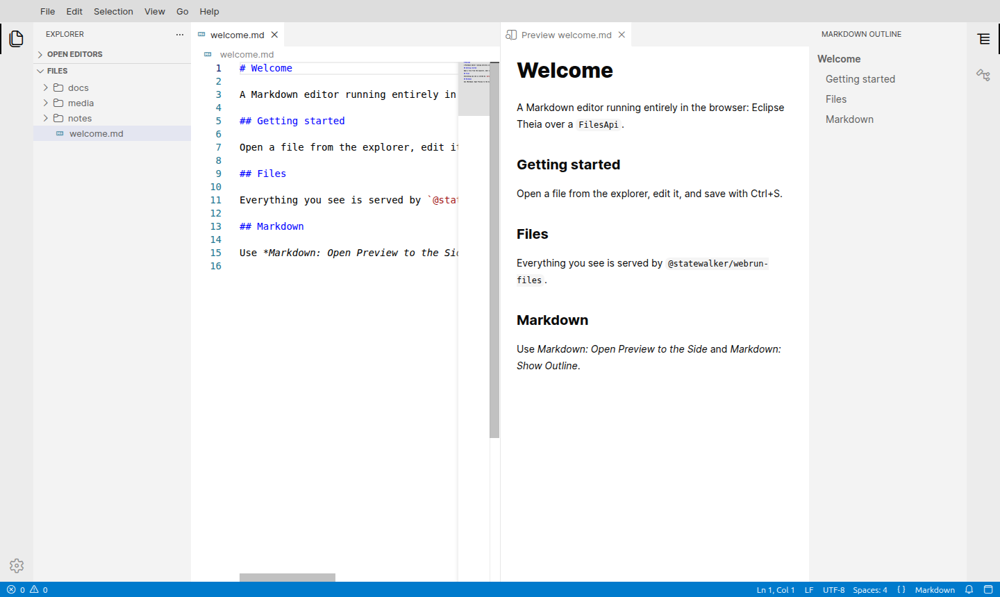
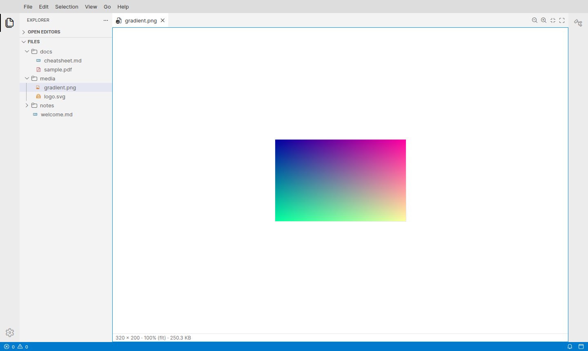
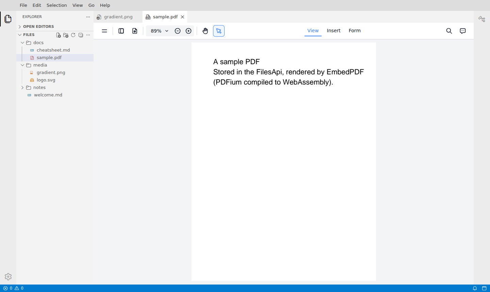

# Theia Shell: Markdown

A Markdown editor with image and PDF viewers, built on **Eclipse Theia 1.76**,
that runs entirely in the browser. There is no backend: the build output is static files. Files come from
[`FilesApi`](https://github.com/statewalker/webrun-files) instances
(`@statewalker/webrun-files`) **mounted** as the top-level folders of the
explorer: browser storage, memory, folders on your computer, S3 buckets.
Secrets such as S3 keys live in a password-protected, encrypted vault.



The screenshots show the opt-in shadcn/ui style (*Appearance: Toggle shadcn/ui Style*). The default is stock Theia.

| Image viewer | PDF viewer (EmbedPDF) |
|---|---|
|  |  |

## Run it

```bash
cd apps/theia-shell
pnpm install
pnpm --filter @theia-shell/app build     # the extensions (tsc), then `theia build`
pnpm --filter @theia-shell/app start     # http://127.0.0.1:3000
```

Any static file server works: `app/lib/frontend/` is the whole app.

- `http://127.0.0.1:3000/` keeps the **main storage** in the browser's Origin
  Private File System, so files and settings survive reloads. The first visit
  asks for a password that protects the secrets vault (*Skip* is allowed; tick
  *Remember on this device* to not be asked again).
- `http://127.0.0.1:3000/?storage=memory` keeps everything in memory, fresh on
  every load, with no password prompt.

An empty main storage ("Browser Storage") is seeded with `welcome.md`, `notes/ideas.md`,
`docs/cheatsheet.md`, `docs/sample.pdf`, `media/gradient.png` and
`media/logo.svg`. The PNG and the PDF are generated in code (`app/files/src/png.ts`,
`createTextPdf`), so no binary fixtures are checked in.

## Mounts, the main storage and secrets

The explorer's top-level folders are **mount points**. By default there are
two: **Browser Storage** (the main storage, key `browser`) and **Temporary**
(in memory, key `temp`).

- **Mount a file system**: *Files: Mount File System…* (command palette, or the
  explorer's context menu). Pick a type — *In Memory*, *Browser Storage (OPFS)*,
  *Folder on this Computer*, *S3 Bucket* — then a name ("Local Computer") and a
  key (the folder name, derived from the name, editable, unique), then the
  type's own fields. S3 keys are typed as passwords and go to the vault.
- **Edit Mount… / Unmount / Reconnect**: on a mount's folder in the explorer.
  A mount that cannot be reached stays listed with its reason — "Cloud
  (unavailable: …)", "Cloud (locked)" while the vault is locked, "Local
  Computer (click Reconnect)" when the browser needs a click to grant access
  again.
- **Settings**: mounts are the `files.mounts` setting, so they come back after
  a reload and can be edited in *Preferences: Open Settings (JSON)*. Secrets
  never appear there.
- **Hidden paths**: the `files.hidden` setting (globs; this app defaults to
  `**/.git`, `**/.git/**`, `**/.DS_Store`) hides paths from the explorer,
  editors and search, live.
- **Main storage**: *Files: Choose Main Storage…* moves your settings and vault
  to a folder on your computer (or back to browser storage). A local-folder main
  storage asks for one click after each reload, as browsers require.
- **Secrets**: *Secrets: Unlock / Lock / Change Password / Forget Remembered
  Password / Reset Vault*. See
  [`theia-secret-vault`](../packages/theia-secret-vault) for the format and
  its limits.

The design is in
[`docs/specs/2026-09-25-pluggable-files-api-design.md`](../docs/specs/2026-09-25-pluggable-files-api-design.md).

## What is in it

| Package | Role |
|---|---|
| [`packages/theia-files-api`](../packages/theia-files-api) | **The file system.** `FilesApiFileSystemProvider` implements Theia's `FileSystemProvider` over a `FilesApi`. The frontend module rebinds `FileSystemProvider` (replacing browser-only OPFS) and `WorkspaceServer` (opening the `FilesApi` root on a first visit), reveals the explorer, and names the root. |
| [`packages/theia-markdown`](../packages/theia-markdown) | **The extension.** Commands, menus, keybindings, the preview and the outline view (below). |
| [`packages/theia-image-viewer`](../packages/theia-image-viewer) | **Image viewer extension.** Opens PNG, JPEG, GIF, WebP, AVIF, BMP, ICO and SVG files in a zoomable view, with commands, tab-toolbar buttons, a *View → Image* menu and keybindings. |
| [`packages/theia-pdf-viewer`](../packages/theia-pdf-viewer) | **PDF viewer extension.** Opens `.pdf` files in [EmbedPDF](https://www.embedpdf.com/) (PDFium in WebAssembly), offline. |
| [`packages/theia-shadcn`](../packages/theia-shadcn) | **shadcn/ui.** The components (on Theia's shared React), the tokens, and an opt-in *shadcn/ui style* (`appearance.style`, or *Appearance: Toggle shadcn/ui Style*) that restyles Theia's menus, dialogs, buttons, inputs and toasts with CSS only. The default is stock Theia. Either style works with any colour theme. |
| [`packages/theia-files-mounts`](../packages/theia-files-mounts) | **Mount points.** The main storage, the mount table (a `CompositeFilesApi`), filter layers, the `files.mounts` / `files.hidden` settings, the mount wizard and commands, and Theia's settings moved to `shell-system:`. Memory, OPFS and local-folder types. |
| [`packages/theia-secret-vault`](../packages/theia-secret-vault) | **Secrets.** A WebCrypto vault behind Theia's `KeyStoreService` / `CredentialsService`, its password dialog and commands. |
| [`packages/theia-files-s3`](../packages/theia-files-s3) | **The S3 mount type** (`webrun-files-s3`); separate because the AWS SDK is large. |
| [`app/files`](files) | **The app's defaults**: the Temporary mount, the hidden paths, the demo files seeded into the main storage, and *New Markdown File* writing there. |
| [`app/style`](style) | **The app's stylesheet**: Tailwind v4 without preflight over the extensions' sources, plus the shadcn theme. The extensions are styled with Tailwind classes, so an app that uses them must compile those classes too. |
| `app` | The browser-only Theia application (`"theia": { "target": "browser-only" }`). |

### Markdown extension contributions

| Kind | What |
|---|---|
| Commands | *Markdown: New Markdown File*, *Open Preview to the Side*, *Show Outline*, *Toggle Bold*, *Toggle Italic*, *Toggle Heading*, and *View: Toggle Markdown Outline* |
| Menus | *File → New Markdown File*; explorer context menu *Open Markdown Preview*; editor context menu *Markdown ▸* (Bold, Italic, Heading, Preview); *View → Markdown Outline* |
| Keybindings | Preview `Ctrl+Shift+V`, Bold `Ctrl+Alt+B`, Italic `Ctrl+Alt+I`, Heading `Ctrl+Alt+H` (in a Markdown editor) |
| Views | **Markdown Preview**: main area, split to the right. It renders the shared text model, so unsaved edits show live. **Markdown Outline**: right side bar, lists the active editor's headings; click one to reveal it. |
| Language | Registers `markdown` for `.md` / `.markdown` with a small Monarch tokenizer. A browser-only app without VS Code plugins has no Markdown grammar otherwise. |

Loading and saving are Theia's own editor flow, which goes through the
`FilesApi` provider. The extension never touches storage, apart from *New
Markdown File*, which creates the file through Theia's `FileService`.

The preview treats file content as **data, never code**. markdown-it runs with
`html: false`, so raw HTML is escaped and `javascript:` links are refused, and
the result is also passed through DOMPurify. This follows the HTTPeers security
model (`httpeers/docs/security-model.md` §2): a document fetched from a peer
must never run on the shell's origin.

## Adding a kind of file system

A new kind of mount is one binding: implement `MountType` (from
`@theia-shell/theia-files-mounts`) — an id, a label, the fields the wizard asks,
and `create(mount, ctx)` returning any `FilesApi` — in a frontend module of its
own package, and `bind(MountType).to(…)`. `theia-files-s3` is the example.
Wrappers around the whole tree (filters, guards, read-only) are
`FilesApiLayer` bindings.

Put the module in its own package, listed in the app's dependencies with a
`theiaExtensions` entry. Theia ignores `theiaExtensions` in the application's
own `package.json`.

An app that wants one fixed `FilesApi` and no mounts can leave out
`theia-files-mounts` and bind `FilesApiSource` from `theia-files-api` instead.

## Tests

```bash
pnpm --filter @theia-shell/theia-files-api test    # 23 unit tests: the FileSystemProvider contract, external changes
pnpm --filter @theia-shell/theia-markdown test     # 15 unit tests: outline, rendering, edits
pnpm --filter @theia-shell/theia-image-viewer test # 9 unit tests: MIME types, fit, zoom steps
pnpm --filter @theia-shell/theia-pdf-viewer test   # 5 unit tests: the generated PDF
pnpm --filter @theia-shell/theia-shadcn test       # 6 unit tests: cn, the button variants, data-slots
pnpm --filter @theia-shell/theia-secret-vault test # 19 unit tests: the vault, the KeyStoreService contract
pnpm --filter @theia-shell/theia-files-mounts test # 30 unit tests: keys, configs, layers, mount table, folder access, queue
pnpm --filter @theia-shell/theia-files-s3 test     # 4 unit tests: client options, the RustFS fixture's CORS
pnpm --filter @theia-shell/app-files test          # 8 unit tests: seeding, the PNG encoder
pnpm --filter @theia-shell/app-style test          # 6 unit tests on the compiled CSS (build first)
pnpm --filter @theia-shell/app test:e2e            # 50 Playwright tests against the static build
```

The 4 S3 e2e tests and one unit test run against RustFS in Docker
([`tools/rustfs.mjs`](../tools/rustfs.mjs)) and are skipped without Docker.

The e2e tests serve `lib/frontend` with a plain static server and drive
Chromium:

- the explorer, open/edit/save and OPFS persistence;
- *New Markdown File* from the File menu;
- the live preview, from the palette and from the explorer context menu;
- the outline, and revealing a heading;
- *Toggle Bold* from the editor context menu;
- *Toggle Heading* by keybinding;
- images: the viewer opens instead of the editor, zoom works from the tab
  toolbar, the keyboard and the palette, and SVG is shown as an image;
- a PDF renders in EmbedPDF with no request to any host other than the app;
- the default style is stock Theia: menus and dialogs keep Theia's shape, and
  the shadcn components take the theme's colours;
- *Toggle shadcn/ui Style* switches the look live on a dark theme, the choice
  survives a reload, and toggling again restores stock Theia;
- the shadcn/ui style, by computed style against the tokens:
  - menus and confirm dialogs take shadcn's shape and colours;
  - the tokens follow a theme switch;
  - Theia's own elements get no preflight;
  - the outline's items are shadcn buttons;
  - the preview is typeset with Tailwind Typography;
  - the image status line uses the muted token.
- mounts: the defaults by name, the wizard (a key from the name, a non-Latin
  name, a duplicate key refused), Edit and Unmount, `files.hidden` live, a
  malformed `files.mounts` entry skipped with a warning, an OPFS mount and a
  local folder surviving a reload;
- the vault: created on the first OPFS visit, asked for after a reload (a wrong
  password shown in the dialog), *Remember on this device*, an empty password
  refused, `settings.json` stored in the main storage's `.shell`, a local-folder
  main storage, and the boot gate;
- S3 against RustFS: files written from the browser land in the bucket, the
  keys are in neither `settings.json` nor `secrets.json` in clear, the mount
  comes back after a reload, "locked" until the vault is unlocked, an
  unreachable endpoint shown as unavailable, a malformed endpoint refused.

Every test also asserts that the page raised no errors.

## Red / green

- **Unit, `theia-markdown`.**
  - Red: 15 of 15 failing against empty stubs.
  - One further red was a wrong expectation in the test. markdown-it leaves
    `[x](javascript:…)` as inert text rather than dropping it, so the test now
    asserts that no `href` is ever a `javascript:` URL.
  - Green: 15 of 15.
- **Unit, `app-files`.** 2 of 2 red against a stub, then green.
- **End to end, with an empty Markdown module.**
  - Red: 7 of 10 failing. The 3 file tests passed on the P2 and P3 work.
  - The root-label test was failing because of a wrong locator: the single root
    is the explorer section's header, not a tree node.
  - Green: 10 of 10 with the extension.
- **Viewers.**
  - Unit: 8 of 8 red, then green (image logic); 4 of 4 red, then green (PNG
    encoder and binary seeding); 4 of 4 green for `createTextPdf`, whose red run
    was a load failure.
  - End to end: 4 of 4 red before the viewers were added to the app, then 4 of
    4 green. The full suite is 14 of 14.
- **Viewers, after review.**
  - Unit: `stepZoom` zoomed *in* when zooming out from below the smallest preset
    (a huge image fitted to the view); 1 red, then 9 of 9 green.
  - End to end, reload and delete: 3 of 4 red. Deleting an open image left it
    on screen unchanged; the PDF viewer never reloaded. The SVG reload test was
    already green. The PDF delete test was written after the fix and was never
    seen red. The full suite is 18 of 18.
- **shadcn/ui and Tailwind.**
  - End to end: 6 of 7 red before the change. The preflight test is a guard
    and passed before and after.
  - First green run: 6 of 7. The active menu item's radius stayed 4px, because
    Theia's rule for the item's cells has specificity 0,3,0. It is now 7 of 7,
    and the full suite is 25 of 25.
  - Unit, `app-style`: the excluded-names test was 1 red, then green. The
    `theia-shadcn` unit tests were written with the components and were never
    seen red.
- **Style switch.** The shadcn look became opt-in, on top of any colour theme.
  - End to end: 9 of 10 red. The 3 new default-style tests and the 6 shadcn
    tests, which now switch the style on first, all failed; the preflight guard
    passed.
  - Green: 10 of 10. The full suite is 28 of 28.
  - Unit, `app-style`: the scoping test, that no rule on Theia's classes
    escapes `body.shadcn-ui`, was checked by removing the scope from one rule.
    2 tests failed, and they passed again once the scope was restored.
- **Mounts and the vault.**
  - Unit: every package test was seen red first (the module missing, or a
    wrong result: `seedIfEmpty` treating `.shell` as content, a missing secret
    reported as "locked" while unlocked). See each package's README.
  - End to end: 33 of 33 red before the app switched to mounts (no "Browser
    Storage" folder, no vault dialog). Then 29 of 33: two were a real race — the
    vault dialog closed before the vault was created, so a reload right after
    could lose the vault key or the remembered key; the operation now runs in
    the dialog, which closes only once it is done — and two were locators (a
    disabled button, a warning shown twice). Green: 33 of 33.
  - S3: 4 of 4 red (no S3 type), then 2 of 4 (a CORS header, a reload before
    Theia wrote `settings.json`), then 4 of 4. With the S3 tests the suite is
    37 of 37.
